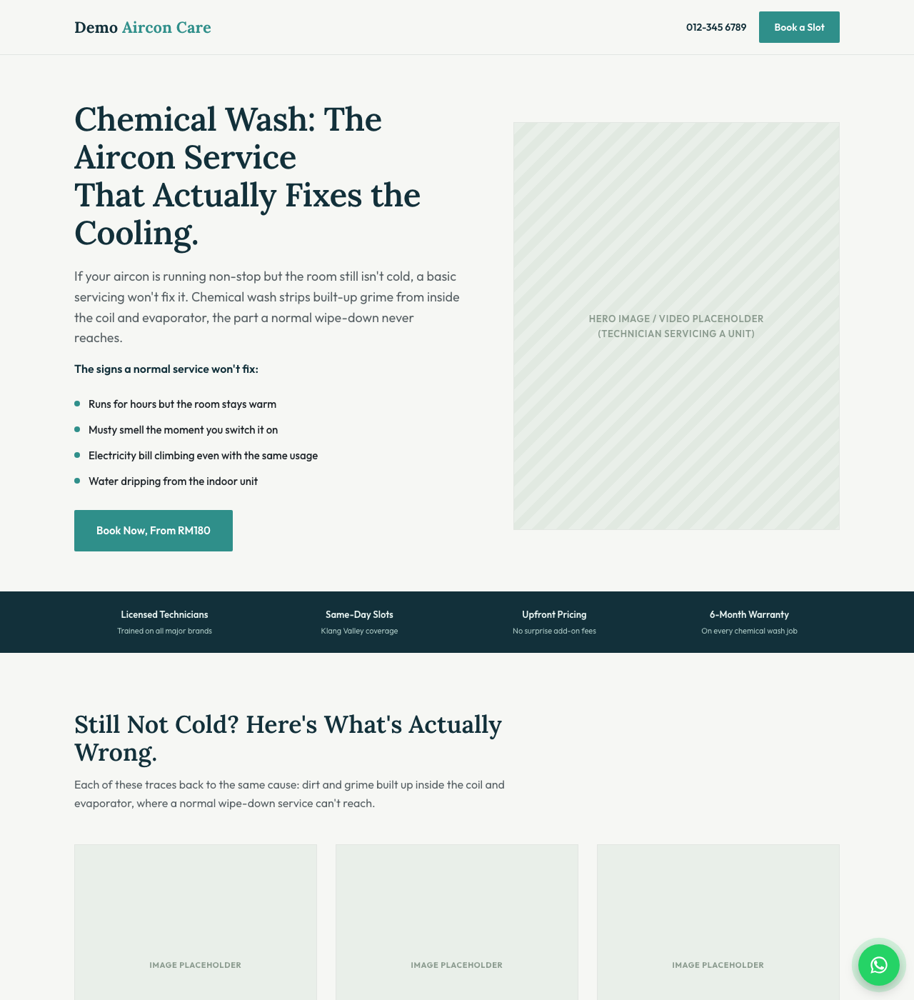

# editorial-landing-page

[](https://github.com/zachlee67/editorial-landing-page/actions/workflows/validate.yml)

A Claude Code / Claude.ai skill for building single-file HTML landing pages in XEDEA's editorial
house style, for any industry: home services, real estate, education/tuition, professional
services/agencies, F&B, e-commerce/DTC, SaaS, and more.

It's the industry-agnostic sibling of `aesthetic-clinic-landing-page` (originally built for a
Malaysia aesthetic clinic client): editorial serif headings, a pain-point-led hero that still
names the offer, no small "eyebrow" labels above headings, no em/en dashes used as sentence
connectors, a pain-point card grid, a mechanism/process explainer, a benefits grid, a primary vs
secondary offer comparison table when there are two related offers, an FAQ accordion, a sticky
contact CTA, and a lead form at the very end of the page. `references/industry-section-map.md`
maps the generic skeleton onto what each section actually means for a given industry. See
`SKILL.md` for the full rules and interview process.

## Install (for colleagues)

Claude Code and Claude.ai load skills from `~/.claude/skills/`. To use this skill:

1. Clone this repo somewhere on your machine:
   ```
   git clone https://github.com/zachlee67/editorial-landing-page.git
   ```
2. Copy (or symlink) the folder into your own skills directory:
   ```
   cp -r editorial-landing-page ~/.claude/skills/
   ```
   (On Windows / WSL, the equivalent Claude Code skills path applies, ask if you're not sure
   where that is on your machine.)
3. Restart Claude Code (or start a new session) so it picks up the new skill.
4. Just ask Claude for what you want, e.g. *"Build me a landing page for [business]'s new
   [service], no pricing shown, WhatsApp number is [number]"* — Claude should reach for this
   skill automatically for a non-clinic landing page request in this house style. If it doesn't,
   invoke it directly with `/editorial-landing-page` (or ask it to use the skill by name).

## Updating

If you improve the skill (a new industry mapping, a better copy pattern, a fix), edit the files,
then:

```
git add -A
git commit -m "describe what changed"
git push
```

Everyone else picks up the change next time they `git pull` in their local clone and re-copy the
folder into `~/.claude/skills/` (or just work directly from a symlinked clone so `git pull` is
enough).

## What it produces

This is the same skeleton as `aesthetic-clinic-landing-page`, applied to a completely different
industry (home services) to prove it isn't clinic-specific:



Open `examples/aircon-servicing-demo.html` in a browser to see the full page (FAQ accordion,
sticky WhatsApp button, and form all work) rather than just the screenshot above. It's a
fictional demo business, not a real client.

## Contents

- `SKILL.md` — the skill's instructions: interview questions, house style rules, build/verify/
  handoff process, and how this skill relates to `aesthetic-clinic-landing-page` and the general
  `landing-page` skill.
- `references/industry-section-map.md` — how the generic section skeleton maps onto specific
  industries (home services, real estate, education, professional services, F&B, SaaS,
  e-commerce), sourced from 2026 conversion research. Add to this file as new industries come up.
- `assets/reference-template.html` — a structural/CSS reference (the same worked example used by
  `aesthetic-clinic-landing-page`, with all client-identifying details replaced by generic
  placeholders). Do not reuse its actual copy or colors for a real client, it's a worked example,
  not a fill-in-the-blank template.
- `examples/aircon-servicing-demo.html` + `examples/preview.png` — a second worked example, built
  fresh for a non-clinic industry (home services / aircon servicing) so it's obvious this skill
  actually generalizes, not just the clinic skeleton with labels swapped.
- `scripts/validate_skill.py` — checks `SKILL.md` has valid frontmatter, every file referenced in
  `SKILL.md`/`README.md` actually exists, and that no real-looking phone/WhatsApp number has
  crept into the repo. Run it yourself with `python3 scripts/validate_skill.py`; it also runs
  automatically on every push via `.github/workflows/validate.yml`.
- `LICENSE` — internal/proprietary, see the file for terms.
